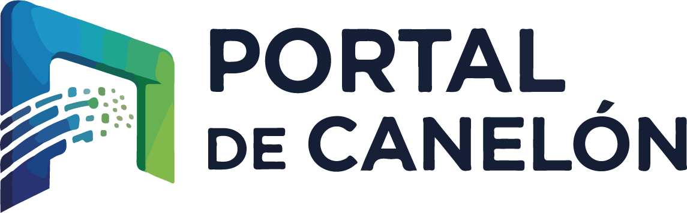

# Portal Development - Tecnología para el Sector Salud



Una página web moderna y profesional para empresa especializada en desarrollo de software médico, construida con React y Vite.

**Tu enlace con la innovación en salud digital** - Desarrollamos soluciones tecnológicas especializadas para hospitales, clínicas y centros de salud.

## 🚀 Características

- ✨ Diseño moderno y responsive
- 🎨 Interfaz atractiva con animaciones suaves
- 📱 Totalmente adaptable a móviles y tablets
- ⚡ Optimizada para rendimiento
- 🎭 Animación Lottie integrada
- 🎯 SEO friendly
- 📦 Lista para subir a hosting compartido

## 🛠️ Tecnologías Utilizadas

- **React 18** - Librería de UI
- **Vite** - Build tool ultrarrápido
- **Lottie React** - Animaciones vectoriales
- **React Icons** - Iconos modernos
- **CSS3** - Estilos personalizados

## 📋 Requisitos Previos

- Node.js (versión 16 o superior)
- npm o yarn

## 🔧 Instalación

1. **Instalar dependencias:**
```bash
npm install
```

2. **Iniciar servidor de desarrollo:**
```bash
npm run dev
```

3. **Ver en el navegador:**
Abre [http://localhost:5173](http://localhost:5173)

## 📦 Build para Producción

Para generar los archivos optimizados para producción:

```bash
npm run build
```

Esto generará una carpeta `dist/` con todos los archivos estáticos listos para subir a tu hosting compartido.

## 🌐 Despliegue en Hosting Compartido

### Pasos para Subir al Hosting:

1. **Generar el build de producción:**
   ```bash
   npm run build
   ```

2. **Subir archivos:**
   - Conecta a tu hosting mediante FTP (FileZilla, WinSCP, o el administrador de archivos de tu hosting)
   - Navega a la carpeta `public_html` o `www` de tu dominio
   - Sube TODO el contenido de la carpeta `dist/` (no la carpeta dist en sí, sino su contenido)

3. **Estructura final en el servidor:**
   ```
   public_html/
   ├── index.html
   ├── logoPortal.png
   ├── developer animation.json
   └── assets/
       ├── index-[hash].js
       ├── index-[hash].css
       └── ...
   ```

4. **Configurar archivo .htaccess (importante para React Router):**
   
   Crea un archivo `.htaccess` en la raíz de tu hosting con este contenido:

   ```apache
   <IfModule mod_rewrite.c>
     RewriteEngine On
     RewriteBase /
     RewriteRule ^index\.html$ - [L]
     RewriteCond %{REQUEST_FILENAME} !-f
     RewriteCond %{REQUEST_FILENAME} !-d
     RewriteCond %{REQUEST_FILENAME} !-l
     RewriteRule . /index.html [L]
   </IfModule>
   ```

### Proveedores de Hosting Compatibles:

- ✅ cPanel
- ✅ Plesk
- ✅ Hostinger
- ✅ GoDaddy
- ✅ Bluehost
- ✅ SiteGround
- ✅ Y cualquier hosting con soporte PHP/HTML

## 🎨 Personalización

### Cambiar colores:

Edita las variables CSS en `src/index.css`:

```css
:root {
  --primary: #6366f1;
  --secondary: #ec4899;
  --dark: #0f172a;
  /* ... más variables */
}
```

### Modificar contenido:

- **Información de empresa:** Edita los componentes en `src/components/`
- **Imágenes:** Reemplaza las imágenes en la carpeta raíz
- **Animación:** Reemplaza `developer animation.json`

### Cambiar datos de contacto:

Edita `src/components/Contact.jsx` con tu información:
- Email
- Teléfono
- Dirección
- Redes sociales

## 📱 Estructura del Proyecto

```
Pagina web/
├── public/
├── src/
│   ├── components/
│   │   ├── Navbar.jsx
│   │   ├── Hero.jsx
│   │   ├── About.jsx
│   │   ├── Services.jsx
│   │   ├── Technologies.jsx
│   │   ├── Portfolio.jsx
│   │   ├── Contact.jsx
│   │   └── Footer.jsx
│   ├── App.jsx
│   ├── App.css
│   ├── main.jsx
│   └── index.css
├── developer animation.json
├── logoPortal.png
├── index.html
├── package.json
└── vite.config.js
```

## 🎯 Secciones de la Página

1. **Hero** - Sección principal con animación Lottie
2. **Nosotros** - Información sobre la empresa
3. **Servicios** - Servicios ofrecidos
4. **Tecnologías** - Stack tecnológico
5. **Portfolio** - Proyectos realizados
6. **Contacto** - Formulario de contacto

## ⚡ Optimizaciones Incluidas

- ✅ Código minificado
- ✅ CSS optimizado
- ✅ Imágenes comprimidas
- ✅ Lazy loading
- ✅ Code splitting
- ✅ Caché de assets

## 🐛 Solución de Problemas

### La página muestra "404" en rutas:
- Asegúrate de haber configurado el archivo `.htaccess`

### Las imágenes no se cargan:
- Verifica que las rutas comiencen con `/` (ej: `/logoPortal.png`)
- Asegúrate de haber subido todos los archivos de la carpeta `dist/`

### Estilos no se aplican:
- Limpia el caché del navegador
- Verifica que el archivo CSS en `assets/` se haya subido correctamente

## 📞 Soporte

Si tienes algún problema o pregunta, no dudes en contactar.

## 📄 Licencia

Este proyecto es privado y está destinado para uso de Portal Development.

---

**Desarrollado con ❤️ para Portal Development**

